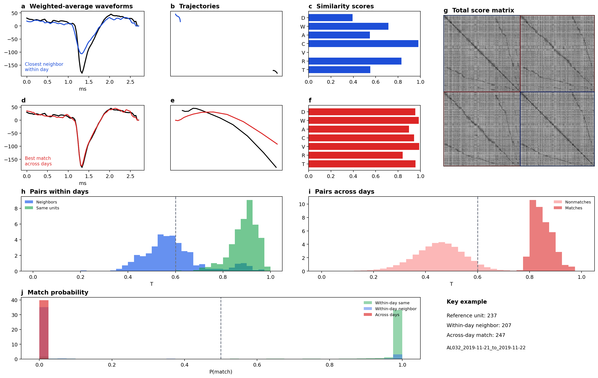
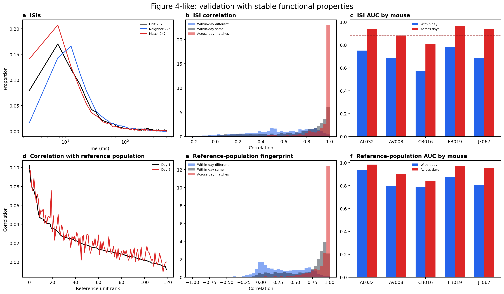
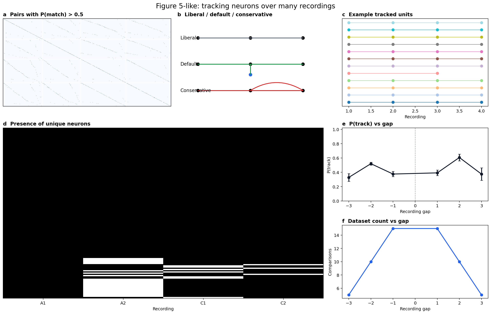

# Tracking neurons across days with high-density probes

## Local Full-Data UnitMatch Report

Generated: 2026-03-25

### Abstract

This package consolidates the full bundled UnitMatch data into a clean paper-style report.
It emphasizes the requested figure families for classifier construction, functional validation, and multi-recording tracking.
The bundled checkout supports waveform matching, ISI validation, and a spike-time-derived reference-population analog, but not natural-image-response validation.

### Key Summary

- Sessions processed: 20
- Pairs processed: 10
- Mice: AL032, AV008, CB016, EB019, JF067
- Acute mean tracked fraction: 40.7%
- Chronic mean tracked fraction: 46.3%
- Within-day false-positive median: 0.19%
- Within-day false-negative median: 9.25%
- ISI across-day AUC mean: 0.906
- Reference-population across-day AUC mean: 0.930

### Results

#### Computing similarity scores and setting up the classifier

#### Validation with stable functional properties

#### Tracking neurons over many recordings

### Data Files

- `within_day_metrics`: `within_day_metrics.csv`
- `pair_tracking`: `pair_tracking.csv`
- `full_data_summary`: `full_data_summary.json`
- `isi_within_day`: `isi_within_day.csv`
- `isi_across_day`: `isi_across_day.csv`
- `refpop_within_day`: `refpop_within_day.csv`
- `refpop_across_day`: `refpop_across_day.csv`
- `tracking_algorithm_summary`: `tracking_algorithm_summary.csv`
- `tracking_gap_table`: `tracking_gap_table.csv`